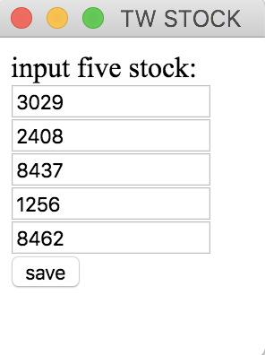

# electron-touch-bar
```
這是一個以electron為基礎撰寫的touch bar app，目前只有mac pro可以使用
主要是因為最近的股票市場很熱絡，加上購買的mac pro的touch bar使用率極低
於是為了讓自己的技術成長，寫了這個在touch bar上面看股票的小工具
```
如果您有興趣也可以自己下載來玩玩看[下載連結](https://drive.google.com/open?id=1aMGcHm6IFYzHxjOM-nIusIsXwYrTDNtn)


這個是簡單的web UI可以自訂5檔股票並儲存


點擊大盤或是個股會進入下一層顯示更詳細資訊


點擊最左側按鈕會直接連結到大盤首頁（Cmoney）


點擊最左側按鈕會直接連結到股票網站（Cmoney）

### 使用到的相關技術
1. electron: 可以完成跨平台平台的app的好工具
2. touchbar: mac pro上方的觸碰螢幕
3. canvas: 因為touch bar目前官方不支援gif以及相關文字圖片結合，故使用連續的圖片來做動圖以及拼接文字圖片來讓面板更有互動性
4. twse: 因為目前沒有現成抓台股的npm套件，所以自己寫了一個[簡易版本](https://www.npmjs.com/package/twse-stock-prices)的套件
5. store: 儲存資訊到user application當中

### 把gif拆分成png連結

https://image.online-convert.com/convert/gif-to-png

## Prerequisites

* latest version of [Node.js](https://nodejs.org/) (at least 6.x.x)
* [MacBook Pro](http://www.apple.com/macbook-pro/) laptop with touch bar

## How to Install

    npm install
    
## How to Run

    npm start

## How to Build

    npm run dist


［免責聲明］：本專案純屬私人研究性質，不做為買賣股票投資之依據，請審慎參考，盈虧自負，切勿抄襲。歡迎按星及分享